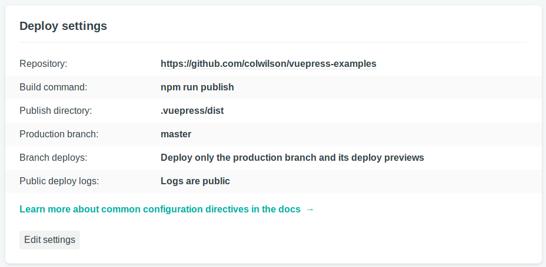

# Deploy to Netlify from Github

Create a **package.json** file like similar to this:

```json
{
  "name": "vuepress-examples",
  "scripts": {
    "start": "vuepress dev",
    "publish": "vuepress build"
  },
  "dependencies": {
    "axios": "^0.18.0",
    "vuepress": "^0.14.1"
  }
}
```
use the **Build command** and **Publish Directory** as shown here:



When you push to master netlify will install via npm and build and deploy your site.
